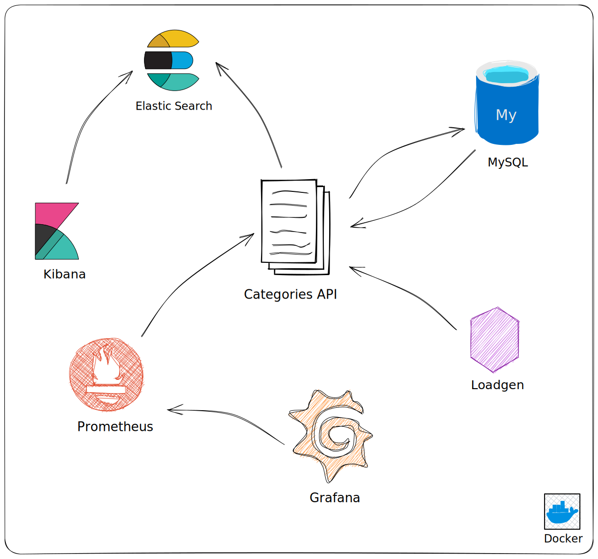
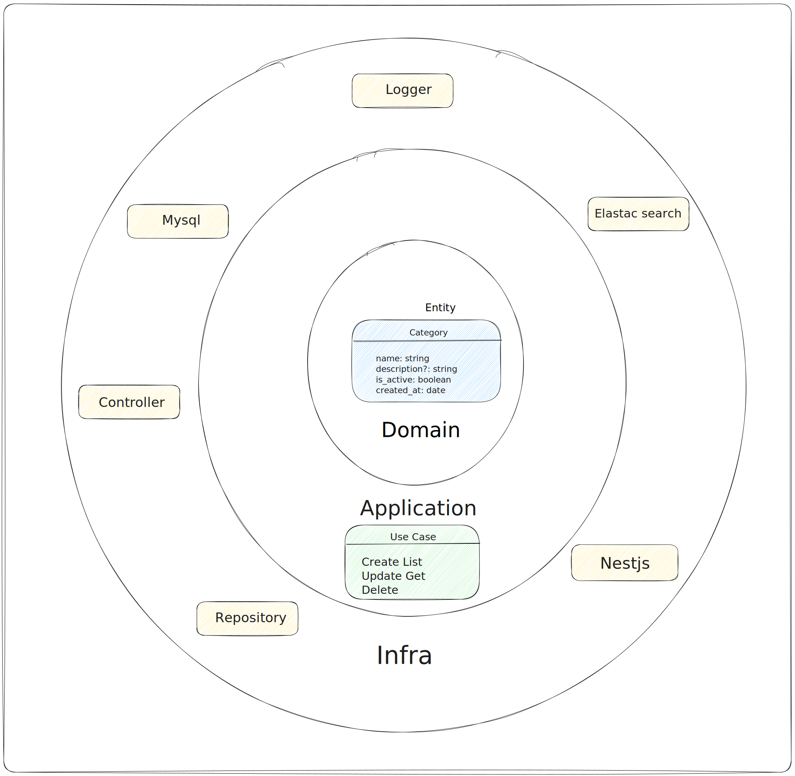

# Microservice Project

This project is composed of a Categories microservice, developed with Nest.js, and several other tools for monitoring, load generation, data persistence, and search. Each service is a Docker container that can be run using Docker Compose.

## Services

Here are the details of each service:

### Categories

This is the main microservice that is built from the `categories/` directory. It is exposed on port 4000.

### Prometheus

Prometheus is a monitoring tool that collects metrics from your service in real-time. In this project, it is configured with the `prom/prometheus:latest` image and is exposed on port 9090.

### Grafana

Grafana is a visualization tool for metrics collected by Prometheus. It is configured with the `grafana/grafana:latest` image and is exposed on port 3000.

### Loadgen

The load generator is a service that generates traffic to your microservice. It is built from the `./loadgenerator` directory and exposed on port 8089.

### MySQL

MySQL is a relational database management system used to store your microservice's data. It is configured with the `mysql:8.0` image and exposed on port 3306.

### Elasticsearch

Elasticsearch is a distributed search and analytics platform. It is configured with the `docker.elastic.co/elasticsearch/elasticsearch:7.14.0` image and is exposed on port 9200. In this project, Elasticsearch is being used to store application logs.

### Kibana

Kibana is a user interface for Elasticsearch that allows you to visualize your indexed data. It is configured with the `docker.elastic.co/kibana/kibana:7.14.0` image and is exposed on port 5601. In this project, Kibana is being used to view the application logs.



## Running the Project

To run this project, make sure you have Docker and Docker Compose installed. Then, from the root directory of the project, run the following command:

```bash
docker-compose up
```

This will start all services. You can access each service by navigating to `localhost:<port>` in your browser, where `<port>` is the port the service is running on.

You can also stop all services by running the following command:

```bash
docker-compose down
```

## API Documentation

The API documentation for the Categories service is available via Swagger and can be accessed at [localhost:4000/api](http://localhost:4000/api) or [localhost:4000/docs](http://localhost:4000/docs). The Swagger documentation provides information about how the API works and how to interact with it.

## Accessing the Services

Once the services are running, you can access them using the following URLs:

- Categories service: [http://localhost:4000](http://localhost:4000)
- Prometheus: [http://localhost:9090](http://localhost:9090)
- Grafana: [http://localhost:3000](http://localhost:3000)
- Load generator: [http://localhost:8089](http://localhost:8089)
- Elasticsearch: [http://localhost:9200](http://localhost:9200)
- Kibana: [http://localhost:5601](http://localhost:5601)

## Categories API Architecture



Please refer to the API documentation or the source code of the Categories microservice for more
